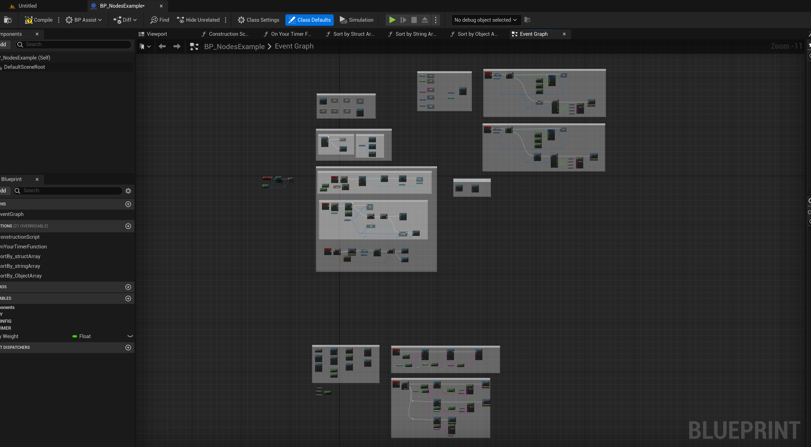
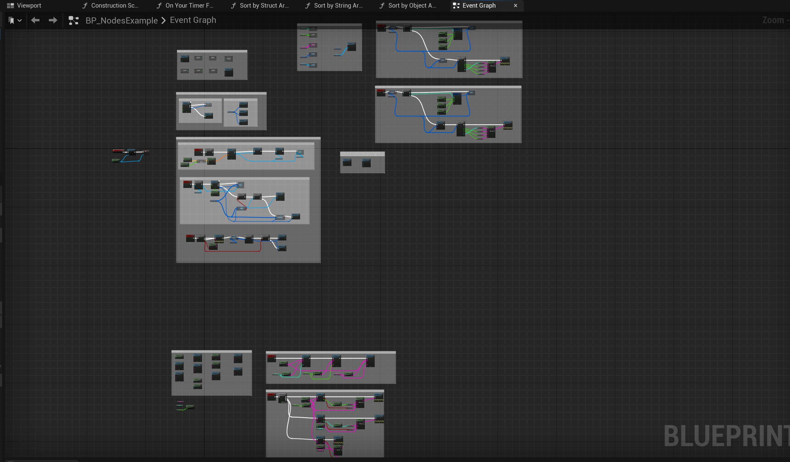
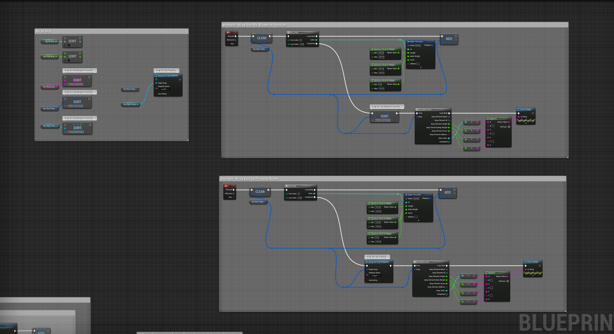
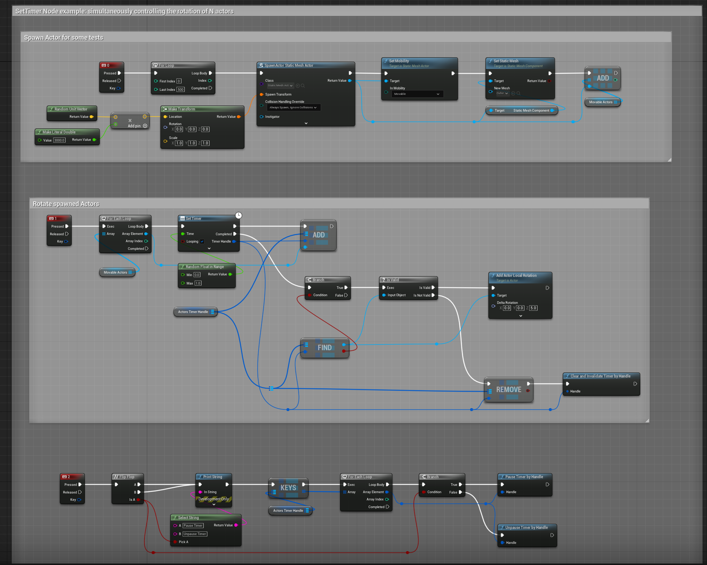

# BlueprintPro Plugin Documentation

## 1. Introduction

BlueprintPro is a plugin written in UE C++ designed to extend the functionality of the Unreal Engine's Blueprint system. The plugin includes a range of wildcard Blueprint nodes for array operations such as sorting, finding maximum and minimum values, and array slice. Additionally, it offers asynchronous Blueprint nodes like SetTimer and  K2Node nodes for getting and setting object property values. The plugin also encompasses Blueprint nodes for handling configuration files, significantly facilitating the Blueprint development process. This tool is tailored for game developers and technical artists, aiming to simplify and accelerate the game development workflow.  The BlueprintPro plugin enhances Unreal Engine's Blueprint system with generic nodes for array operations, asynchronous tasks, and property management.

## 2. Quick Start

This section helps you get started with the BlueprintPro plugin quickly. Follow these steps to install and begin using the plugin in your Unreal Engine project.

### Step 1: Installation

#### 	1.**Download the Plugin**:

- Obtain the BlueprintPro plugin from the Unreal Engine Marketplace or the provided source.

#### 	2. **Add to Your Project (Recommended)**:

- While this step is not mandatory, it is recommended for seamless integration and accessibility within your project.
- If you choose to add it, unzip the downloaded file and place the BlueprintPro plugin folder into your project’s `Plugins` folder.
- If the `Plugins` folder does not exist in your project directory, you have the option to create it at the root of your project. However, this is only necessary if you decide to directly integrate the plugin into your project structure.

#### 	3. **Enable the Plugin**:

- Open your project in Unreal Engine Editor .
- Navigate to `Edit` > `Plugins`, find BlueprintPro in the list, and check the box to enable it.
- Restart the Unreal Engine Editor to apply changes.

### Step 2:  **Finding Nodes in the Blueprint Graph**:

​	After enabling the BlueprintPro plugin, its nodes are integrated directly into the Unreal Engine Blueprint Editor.

- Open a Blueprint file. This can be an existing Blueprint, or you can create a new one.
- In the Blueprint Editor, right-click on the graph area to open the node search menu.
- Type the specific node name or relevant keywords into the search box. For instance, if you want to use the “Array Sort” node, search for “Array Sort”.
- Select the desired BlueprintPro node from the search results and drag it into your Blueprint Graph.
- You can now connect these new nodes to other nodes in the graph, just like any other nodes in Unreal Engine.
- 

### Step 3: Running a Simple Example Project

- **Clone the Project**: Use the `git clone https://github.com/xusjtuer/BlueprintPro.git` command in your command line or terminal to clone the project to your computer.
- **Enable BlueprintPro Plugin**: Go to `Edit` > `Plugins`, find the BlueprintPro plugin, and make sure it's enabled.
- *Find `BP_NodesExample`**: In the Project Browser, locate the `BP_NodesExample` Blueprint file.**
- Open and Run**: Double-click to open the Blueprint and run the example to see it in action.

## 3. Feature Overview

 Wildcard Blueprint nodes for array operations including sorting, finding maximum and minimum values, and splitting arrays.
 Asynchronous Blueprint nodes such as SetTimer for efficient timing functions.
 K2Node nodes for getting and setting object property values.
Config Blueprint nodes dedicated to handling and processing configuration files.

**Current list of nodes**
**Array Node:** 
Is Valid Index? 
Slice
Max Array Elem
Min Array Elem
Array Sort (Int)
Array Sort (Float)
Array Sort By Function
Array Sort By Property

**Async Node：**
Set Timer

**K2Node**
Get Property Value By Name
Set Property Value By Name

**Config Node：**
Set Value
Get Value
Set String Array
Get String Array
Get Property Name
Get Config File Names
Get Section Names
Does Section Exist
Remove Key
Remove Section
Empty Sections Matching String
Get Object Default Section

## 4. Usage Examples

**Preview ：**

- **Array Sort wildcard node**

- **Custom async node SetTimer**

- **custom config Nodes**

## 5. Additional Resources

For a more interactive learning experience, we have compiled a series of video tutorials and demonstrations available on our Bilibili playlist. These videos cover a range of topics from basic setup to advanced features of the BlueprintPro plugin.

Explore our curated playlist for in-depth tutorials, practical demonstrations, and tips to help you maximize the potential of the BlueprintPro plugin in your Unreal Engine projects.

playList：[BlueprintPro Plugin Tutorial 0 - List all blueprint nodes-童年的琴-Plugin Tut-哔哩哔哩视频 (bilibili.com)](https://www.bilibili.com/list/183544702?sid=3863063&spm_id_from=333.999.0.0&desc=1&oid=580397037&bvid=BV1a64y1J7uM)

- **BlueprintPro Plugin Tutorial 0 - List all blueprint nodes**

- <iframe height="800" width="600" src="//player.bilibili.com/player.html?aid=580397037&bvid=BV1a64y1J7uM&cid=1384463919&p=1" scrolling="no" border="0" frameborder="no" framespacing="0" allowfullscreen="true"> </iframe>

- ### **BlueprintPro Plugin Tutorial 1 - Example of Using Wildcard Node Array Sort**

- <iframe height="800" width="600" src="//player.bilibili.com/player.html?aid=325441021&bvid=BV1tw411G7kj&cid=1384464012&p=1" scrolling="no" border="0" frameborder="no" framespacing="0" allowfullscreen="true"> </iframe>

- **BlueprintPro Plugin Tutorial 2 - Example of Using Async SetTimer Node**

<iframe height="800" width="600" src="//player.bilibili.com/player.html?aid=537888726&bvid=BV1fi4y1h7At&cid=1384463907&p=1" scrolling="no" border="0" frameborder="no" framespacing="0" allowfullscreen="true"> </iframe>

- **BlueprintPro Plugin Tutorial 3 - Example of Using Configuring Node**

<iframe height="800" width="600" src="//player.bilibili.com/player.html?aid=835389458&bvid=BV1Dg4y1k7m7&cid=1384464001&p=1" scrolling="no" border="0" frameborder="no" framespacing="0" allowfullscreen="true"> </iframe>

## 6.Support and Contact Information

For any questions or support related to BlueprintPro:

- **Email:** xusjtuer@163.com
- **Twitter:** @sjtuerxu

We're here to help!

