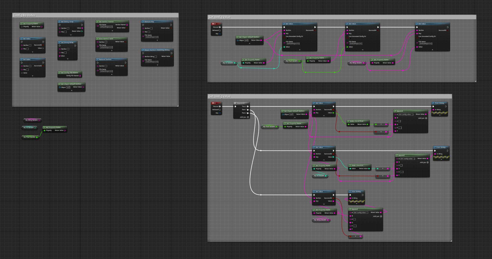

# BlueprintPro Plugin Documentation

## Introduction

BlueprintPro is a plugin written in UE C++ designed to extend the functionality of the Unreal Engine's Blueprint system. The plugin includes a range of wildcard Blueprint nodes for array operations such as sorting, finding maximum and minimum values, and array slice. Additionally, it offers asynchronous Blueprint nodes like SetTimer and  K2Node nodes for getting and setting object property values. The plugin also encompasses Blueprint nodes for handling configuration files, significantly facilitating the Blueprint development process. This tool is tailored for game developers and technical artists, aiming to simplify and accelerate the game development workflow.  The BlueprintPro plugin enhances Unreal Engine's Blueprint system with generic nodes for array operations, asynchronous tasks, and property management.

## Quick Start

This section helps you get started with the BlueprintPro plugin quickly. Follow these steps to install and begin using the plugin in your Unreal Engine project.

### Step 1: Installation

1. **Download the Plugin**: Download the BlueprintPro plugin from the Unreal Engine Marketplace or the provided source.
2. **Add to Your Project**: Unzip the downloaded file and place the BlueprintPro plugin folder into your project’s `Plugins` folder. If this folder does not exist, create it at the root of your project directory.
3. **Enable the Plugin**: Open your project in Unreal Engine. Navigate to `Edit` > `Plugins`, find BlueprintPro in the list, and check the box to enable it. Restart the Unreal Engine Editor to apply changes.

### Step 2: Basic Setup

1. **Accessing BlueprintPro**: Once the plugin is enabled, you can access its features through the Unreal Engine Editor. Typically, this would be through a new menu item, toolbar button, or context menu in the editor.

2. **First Usage**: Demonstrate a simple task. For example, if BlueprintPro adds new nodes to Blueprints, show how to add and configure one of these nodes in a Blueprint.

   Example:

   - Open a Blueprint.
   - Right-click in the graph area and search for a specific BlueprintPro node.
   - Add the node and connect it to other nodes as required.

### Step 3: Running a Simple Example

Provide a simple, clear example that users can follow to see the plugin in action. This could be a short tutorial on creating a basic functionality using BlueprintPro.

Example:

- Describe the creation of a simple game mechanic or visual effect using BlueprintPro.
- Include step-by-step instructions and screenshots.

### Step 4: Next Steps

Direct users to the next sections of the documentation for more detailed information on features, advanced usage, and best practices.

## Feature Overview

 Wildcard Blueprint nodes for array operations including sorting, finding maximum and minimum values, and splitting arrays.
 Asynchronous Blueprint nodes such as SetTimer for efficient timing functions.
 K2Node nodes for getting and setting object property values.
Config Blueprint nodes dedicated to handling and processing configuration files.

**Current list of nodes**
**Array Node:** 
Is Valid Index? 
Slice
Max Array Elem
Min Array Elem
Array Sort (Int)
Array Sort (Float)
Array Sort By Function
Array Sort By Property

**Async Node：**
Set Timer

**K2Node**
Get Property Value By Name
Set Property Value By Name

**Config Node：**
Set Value
Get Value
Set String Array
Get String Array
Get Property Name
Get Config File Names
Get Section Names
Does Section Exist
Remove Key
Remove Section
Empty Sections Matching String
Get Object Default Section

## Advanced Usage

**Preview ：**

**Array Sort wildcard node**

**Custom async node SetTimer**

**custom config Nodes**

## Additional Resources

For a more interactive learning experience, we have compiled a series of video tutorials and demonstrations available on our YouTube playlist. These videos cover a range of topics from basic setup to advanced features of the BlueprintPro plugin.

Explore our curated playlist for in-depth tutorials, practical demonstrations, and tips to help you maximize the potential of the BlueprintPro plugin in your Unreal Engine projects.

**Access the Playlist Here:** [BlueprintPro Tutorials on YouTube](https://www.youtube.com/playlist?list=PLAobe55AteJb_JQvq6r06VIloSUnDX_cS)

## Support and Contact Information

For any questions or support related to BlueprintPro:

- **Email:** xusjtuer@163.com
- **YouTube:** [xu sjtuer](https://www.youtube.com/channel/UCGLRtSr5FnwZEiekGL_5oEw)
- **Twitter:** @sjtuerxu

We're here to help!

